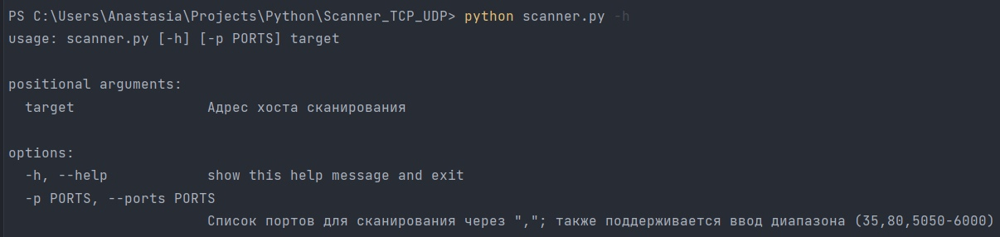
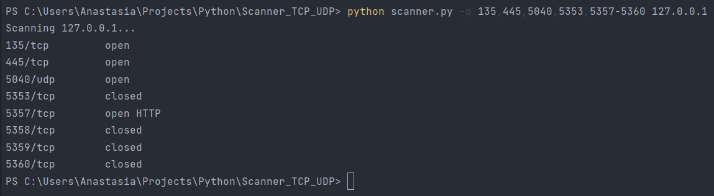

Scanner_TCP_UDP
=============
Автор
-------------
Проект реализован студенткой группы КН-201 Новиковой Анастасией.

Описание
-----------
Программа на языке Python, которая позволяет сканировать порты хоста с целью определения открытости или закрытости.

Особенности
-----------

*   Распараллеленная работа.
*   Выводит информацию о протоколе на данном порте.

Принцип работы:
-----------

*   Создаем потоки для обработки портов
*   По базе данных опеределяется тип соединения на данном порте 
*   Устанавливается соединение с портом, проверяется, открыт или закрыт данный порт
*   Отправляется запрос для определения протокола, который работает на данном порте
*   Получается ответ и достается информация о протоколе

Использование
-------------
Вы можете запустить утилиту с флагом -h, чтобы увидеть, как передаются параметры:

Примеры использования клиента:

